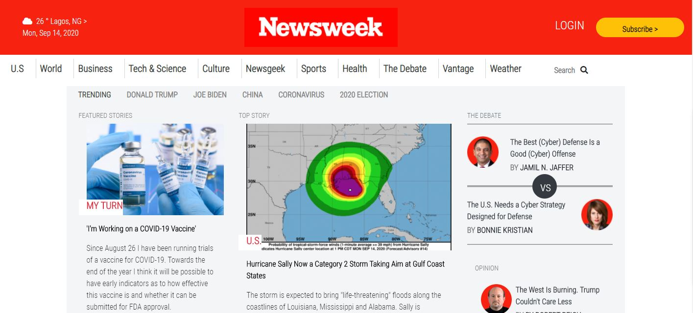

> # NewsWeek---Bootstrap
Building a webpage using Bootstrap

Building a responsive webpage using Bootstrap.

## Built With

- HTML
- CSS
- Bootstrap

## Live Demo

[Live Demo Link](https://deikdesign.github.io/NewsWeek-Bootstrap/)

## Authors

👤 **Deyan Todorov**

- GitHub: [@githubhandle](https://github.com/deikdesign)
- Twitter: [@twitterhandle](https://twitter.com/deikdesign)

👤 **Kingsley Ibeh**

- GitHub: [@githubhandle](https://github.com/Kingobaino1)
- Twitter: [@twitterhandle](https://twitter.com/ibehkingso)
- Linkedin: [linkedin] (https://www.linkedin.com/in/ibeh-kingsley-obinna-568596177)

## 🤝 Contributing

Contributions, issues, and feature requests are welcome!

Feel free to check the [issues page](issues/).

## Show your support

Give a ⭐️ if you like this project!

## Acknowledgments

- Hat tip to anyone whose code was used
- Inspiration
- etc

## 📝 License

This project is [MIT](lic.url) licensed.
